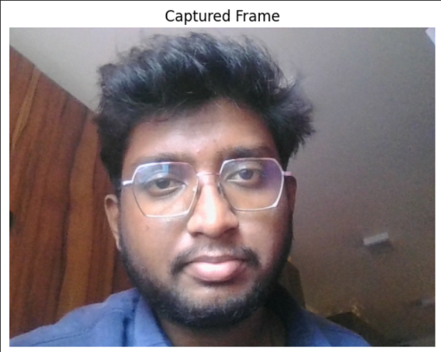
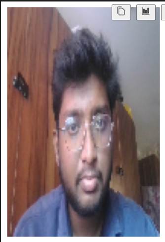
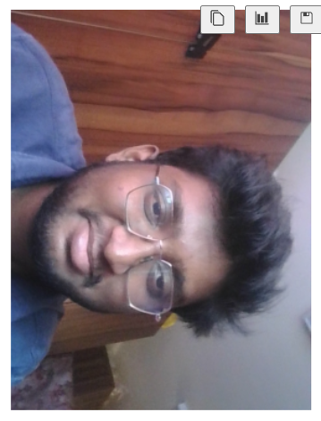

Aim:
 
To write a python program using OpenCV to capture the image from the web camera and do the following image manipulations.
i) Write the frame as JPG 
ii) Display the video 
iii) Display the video by resizing the window
iv) Rotate and display the video

## Software Used
Anaconda - Python 3.7
## Algorithm
### Step 1:
Import the cv2 and numpy package.
<br>

### Step 2:
Read the Video frame using the cv2.VideoCapture(0)
<br>

### Step 3:
Write the image using imwrite().
<br>

### Step 4:
Display the frame using the imshow().
<br>

### Step 5:
Divide the frame into halves and assign the smaller frame and Rotate the frame using the cv2.rotate().
<br>

## Program:
``` Python
### Developed By: Abishek Priyan M
### Register No: 212224240004

## i) Write the frame as JPG file

import cv2
import matplotlib.pyplot as plt
from IPython.display import clear_output
import time
cap = cv2.VideoCapture(0)
ret, frame = cap.read()
if ret:
    cv2.imwrite("captured_frame.jpg", frame)
cap.release()
captured_image = cv2.imread('captured_frame.jpg')
plt.imshow(captured_image[:,:,::-1])
plt.title('Captured Frame')
plt.axis('off')
plt.show()


## ii) Display the video

cap = cv2.VideoCapture(0)

for i in range(50):
    ret, frame = cap.read()
    if not ret:
        break
    frame_rgb = cv2.cvtColor(frame, cv2.COLOR_BGR2RGB)
    clear_output(wait=True)
    plt.imshow(frame_rgb)
    plt.axis('off')
    plt.show()
    time.sleep(0.05)

cap.release()


## iii) Display the video by resizing the window

import cv2
cap = cv2.VideoCapture(0)

for i in range(50):
    ret, frame = cap.read()
    if not ret:
        break
    resized_frame = cv2.resize(frame, (100, 150))  # Resize to 320x240
    frame_rgb = cv2.cvtColor(resized_frame, cv2.COLOR_BGR2RGB)
    clear_output(wait=True)
    plt.imshow(frame_rgb)
    plt.axis('off')
    plt.show()
    time.sleep(0.05)

cap.release()


## iv) Rotate and display the video

cap = cv2.VideoCapture(0)

for i in range(50):
    ret, frame = cap.read()
    if not ret:
        break
    rotated_frame = cv2.rotate(frame, cv2.ROTATE_90_CLOCKWISE)
    frame_rgb = cv2.cvtColor(rotated_frame, cv2.COLOR_BGR2RGB)
    clear_output(wait=True)
    plt.imshow(frame_rgb)
    plt.axis('off')
    plt.show()
    time.sleep(0.05)

cap.release()


```
## Output

### i) Write the frame as JPG image

</br>
</br>


### ii) Display the video

</br>
</br>


### iii) Display the video by resizing the window

</br>
</br>


### iv) Rotate and display the video

</br>
</br>


## Result:
Thus the image is accessed from webcamera and displayed using openCV.
